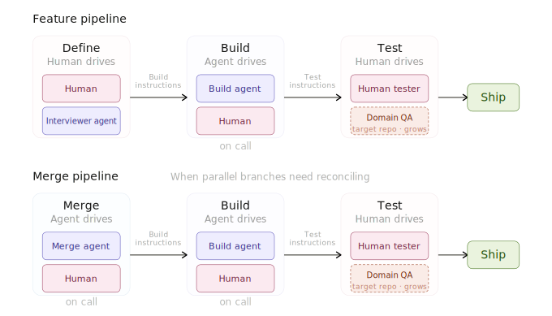

# Software Factory

A machine that builds software.

Decompose the work of building software into discrete phases with clear handoffs. Each phase has an explicit driver — either a human or an agent — and the other plays a supporting role. The more discrete the phases, the more independently each can be optimized, measured, and progressively automated.

## The pipeline

Every feature flows through: **Define → Build → Test**

Each phase reads instructions from the previous phase, does its work, and writes instructions for the next. The plan file is the medium.

<p align="center">
  
</p>

| Phase | Driver | Supporting | What happens |
|-------|--------|------------|--------------|
| **Define** | Human | Interviewer Agent | Human decides what to build. Agent interviews, challenges, reads the codebase, produces the plan. |
| **Build** | Agent | Human (on call) | Build Agent picks up the plan, writes tests first, builds the implementation. Human handles judgment calls. |
| **Test** | Human | Domain QA Agent | Human judges the work against the plan. Domain QA (built in the target repo) progressively automates. |
| **Merge** | Agent | Human (on call) | When branches diverge. Merge Agent reads plans and code from both sides, produces a convergence plan. |

For the full design philosophy, see [docs/design.md](docs/design.md).

## Setup

1. Clone this repo alongside your project repos:
   ```
   workspace/
   ├── software-factory/    # this repo
   ├── my-app-feature-1/    # ephemeral clone (created by bin/clone)
   └── my-app-feature-2/    # another ephemeral clone
   ```

2. Configure git remotes:
   ```bash
   cp .repos.example .repos
   # Edit .repos — set your default remote and any per-repo overrides:
   # default=git@github.com:myorg
   # special-repo=git@github.com:other-org
   ```

3. (Optional) Add env vars and VS Code settings for your repos:
   - `.env.my-app` — copied into clones as `.env`
   - `.vscode.my-app/` — copied into clones as `.vscode/`

4. Your target repo should have a `CLAUDE.md` with codebase conventions (framework patterns, naming, formatting rules, etc.). The agents read this to understand how to write code that fits.

## Commands

### Clone
```bash
bin/clone <repo-name> [feature-name]
```
Creates an ephemeral clone. Runs `uv sync` if Python, copies `.env` and `.vscode` settings if configured.

### Define
```bash
bin/plan <clone-dir> [feature-name]
```
Interactive session. The Interviewer Agent reads the codebase, asks non-obvious questions, and produces a plan in `plans/`. Gets a second opinion from the Review Tool before committing.

### Build
```bash
bin/build <clone-dir>
```
The Build Agent reads the plan, writes tests first, builds the implementation, commits incrementally. Uses the Review Tool to catch issues before escalating. Updates the plan with implementation notes and a "What to Test" section for the Test phase.

### Plan Review
```bash
bin/plan-review <clone-dir>
```
Human reviews a plan with a neutral thinking partner. The Review Agent summarizes the plan, interviews the human about their concerns, and traces implications through the codebase. Output is plan updates or appended review notes.

### Build Review
```bash
bin/build-review <clone-dir>
```
Human reviews completed build work with a neutral thinking partner. The Build Review Agent reads the diff and (optionally) the original plan, summarizes what was asked for vs what was built, and interviews the human about their concerns. Flexible input — branch diffs, commit ranges, or already-merged work.

### Merge
```bash
bin/plan-merge <clone-dir> <branch-a> <branch-b>
```
The Merge Agent analyzes both branches — reads plans, diffs, and commit messages to understand intent. Produces a convergence plan (`.merge.md`), then `bin/build` executes it.

### Hack
```bash
bin/hack <clone-dir>
```
For work that doesn't need a plan in git — debugging, iteration, small fixes. Human and agent collaborate in a single session.

### Status & Cleanup
```bash
bin/status                          # dashboard of active clones
bin/clone-nuke <clone-dir>          # safely delete a clone
bin/clone-nuke <clone-dir> --check  # check if nukable without deleting
```

## How it works

**The plan is the handoff.** Define writes instructions for Build. Build writes instructions for Test. Merge writes instructions for the merge builder. The format is a markdown file in `plans/`. The content changes meaning at each handoff.

**Authority inverts between phases.** In Define, the human is in charge and the agent serves. In Build, the agent is in charge and the human serves. This is deliberate — human attention goes where it's most valuable (deciding what to build), agent autonomy goes where it's most efficient (actually building it).

**The Review Tool is infrastructure.** A different model (currently Codex) providing a second opinion. Any agent can invoke it. The driving agent decides how to filter and present the findings — the Review Tool never talks to the human directly.

**Ephemeral repos are load-bearing.** Every feature gets its own clone. Cattle, not pets. This means features build in parallel, bad builds get thrown away, and the merge path exists because branches are genuinely independent. The human pushes when satisfied — agents cannot push.

**Progressive automation is the meta-game.** Every phase is a discrete box — a separate prompt, evaluation surface, and automation candidate. The Domain QA Agent (built in the target repo, not here) is the clearest example: it starts thin and absorbs more of what the human tester does over time. The boundary between human and agent is discovered through operation, not designed upfront.

## Permissions

No `--dangerously-skip-permissions`. Agents get explicit `--allowedTools`:

- **File ops:** `Edit`, `Write`, `Read`, `Glob`, `Grep`
- **Git:** specific commands only — `add`, `commit`, `diff`, `log`, `status`, `branch`, `checkout`, `show`, `stash`, `rev-parse`, `fetch`, `merge`, `merge-base`, `rev-list`, `ls-tree`, `merge-tree`. No `push`, no `reset`, no `remote`.
- **Build tools:** `uv`, `ruff`, `python`, `pytest`
- **Review:** `codex review` only
- **Shell:** `ls`, `cat`, `head`, `tail`, `grep`, `find`, `tree`, `sed`, `awk`, etc.

Tool definitions live in `lib/allowed-tools.sh`.

## File structure

```
software-factory/
├── bin/
│   ├── clone           # Clone repo, setup env and vscode
│   ├── plan            # Launch interviewer agent (Define phase)
│   ├── plan-review     # Launch plan review agent (plan feedback)
│   ├── build-review    # Launch build review agent (build feedback)
│   ├── build           # Launch build agent (handles feature and merge plans)
│   ├── plan-merge      # Launch merge agent
│   ├── hack            # Launch hack mode
│   ├── status          # Show active clones dashboard
│   └── clone-nuke      # Safely delete ephemeral clones
├── lib/
│   ├── allowed-tools.sh    # Shared tool permission definitions
│   └── agent-session.sh    # Session tracking helpers
├── prompts/
│   ├── plan.md             # Interviewer agent prompt (Define)
│   ├── plan-review.md      # Plan review agent prompt
│   ├── build-review.md     # Build review agent prompt
│   ├── build.md            # Build agent prompt
│   ├── plan-merge.md       # Merge agent prompt
│   └── hack.md             # Hack mode prompt
├── plans/                  # Feature and merge plans
├── docs/
│   ├── design.md           # Full design philosophy
│   └── pipeline.svg        # Pipeline diagram
├── .repos.example          # Example remote config (copy to .repos)
└── CLAUDE.md
```
